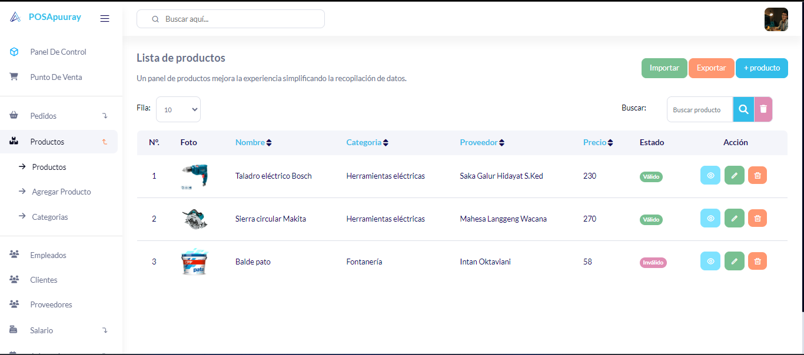

## Punto de venta Laravel

Gestión de Punto de Venta 





## Características⭐
- punto de venta
- Pedidos
  - Ordenes pendientes
  - Órdenes completas
  - Pendiente de vencimiento
- Gestion de Stocks
- Productos
  - Productos
  - Categorías
- Proveedores


1. **Configuración**
    ```bash
    # Ir al repositorio
    $ cd sistema-punto-de-venta

    # Instalar dependencias
    $ composer install

    # Abre con tu editor de texto
    $ code .
    ```
1. **.ENV**

    Cambie el nombre o copie el `.env.example` archivo a `.env`
    ```bash
    # Generar clave de aplicación
    $ php artisan key:generate
    ```
    ```
1. **Configurar base de datos**

    Configure las credenciales de su base de datos en su archivo `.env`

1. **Base de datos de semillas**
    ```bash
    $ php artisan migrate:fresh --seed

    #Nota: Si muestra un error, intente volver a ejecutar este comando.
    ```
1. **Ejecutar servidor**

    ```bash
    $ php artisan serve
    ```
1. **Acceso al sistema**

    Intente iniciar sesión con nombre de usuario: `admin` y password: `password`

## 🚀 Configuración

1. **Ejecutar servidor**

    ```bash
    $ php artisan serve
    ```
1. **Login**

    Intente iniciar sesión con nombre de usuario: `admin` y password: `password`


